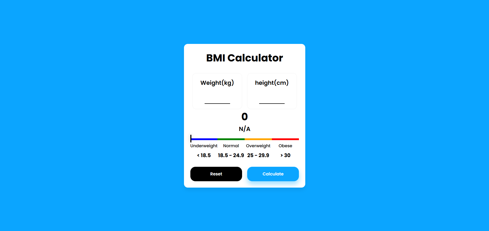

# 🧮 BMI Calculator  

A simple and responsive **BMI (Body Mass Index) Calculator** built with **HTML, CSS, and JavaScript**.  
This tool allows users to calculate their BMI based on weight (kg) and height (cm), and visually displays the BMI category (Underweight, Normal, Overweight, Obese) using a color-coded indicator.  


## ✨ Features  
- 🔢 Calculate BMI instantly based on weight & height input  
- 📊 Color-coded BMI indicator (Underweight, Normal, Overweight, Obese)  
- 🖥️ Clean and responsive UI design  
- ♻️ Reset button to clear inputs and results  
- 🚀 Lightweight and beginner-friendly project  


## 📷 Preview  
  

## 🌐<a href="https://bmi-diwaker.netlify.app/">Live</a>

## 🛠️ Tech Stack  
- **HTML5**  
- **CSS3**  
- **JavaScript (Vanilla JS)**  


## 🎯 Use Cases  
- Personal fitness tracking

## 🚀 Getting Started  

1. Clone the repository  
   ```bash
   git clone https://github.com/your-username/bmi-calculator.git


## 
<div align="center" ><h4>Made with ❤️ by Diwaker</h4></div> 
